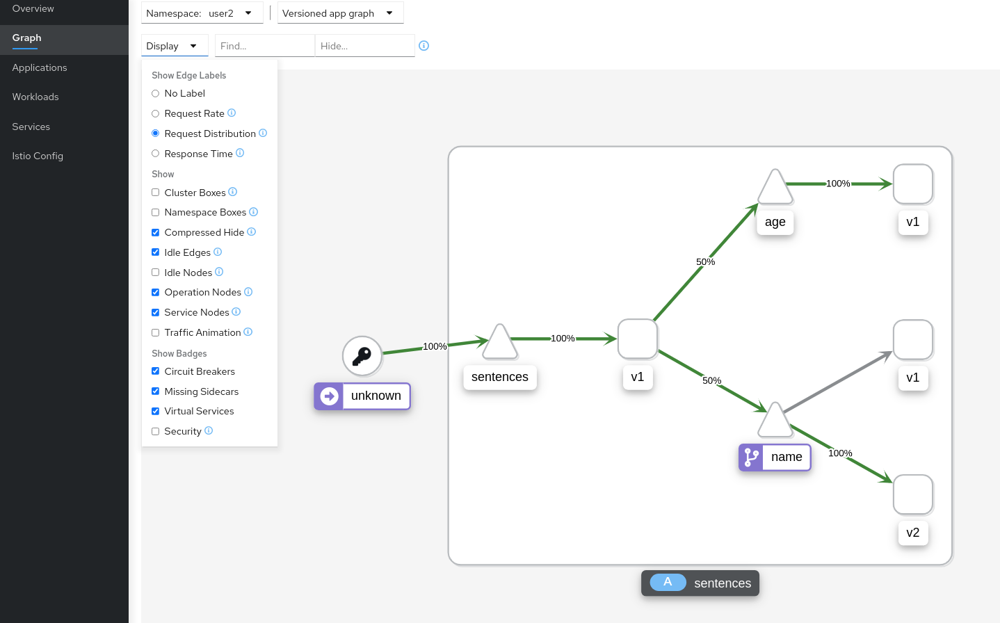
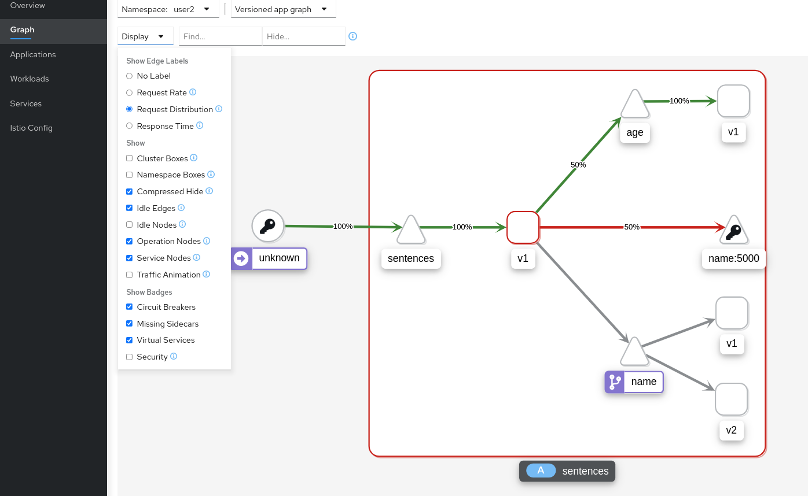
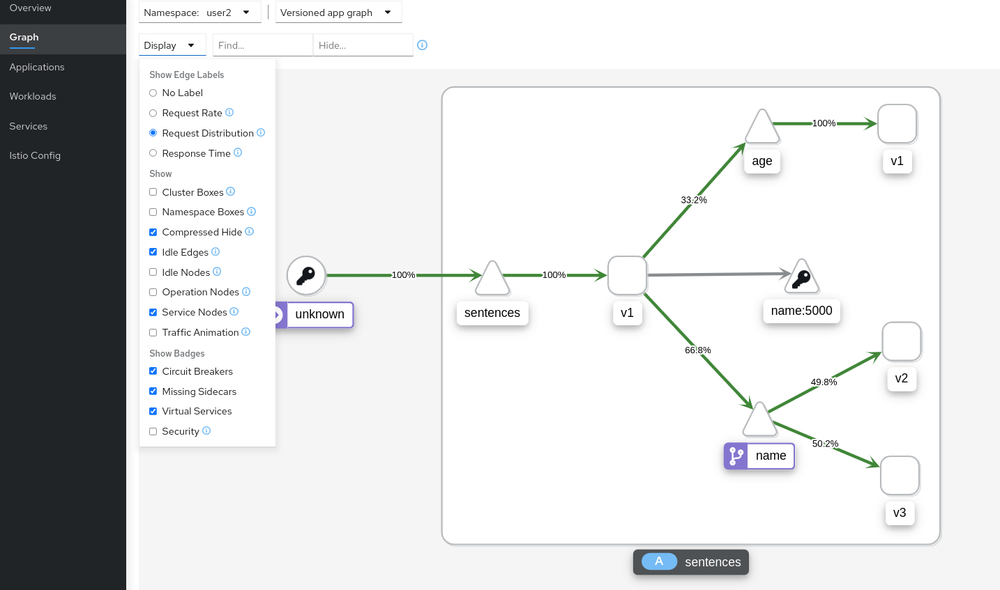

[//]: # (Copyright, Eficode )
[//]: # (Origin: https://github.com/eficode-academy/istio-katas)
[//]: # (Tags: #sentences #kiali)

# Deployment Patterns

## Learning goal

- Basic use of match criteria in a virtual service
- Use header based routing for blue/green deployment
- Use weighted traffic distribution for canary deployment
- Mirror traffic for shadow deployment

## Introduction
These exercises will introduce you to the match, weight and mirror fields of the 
HTTPRoute. These fields and their combinations can be used to enable several 
useful deployment patterns.

These exercises build on the [Basic traffic routing](basic-traffic-routing.md) exercises.

## Exercise 1

This exercise is going to introduce you to the HTTPRoute `match` field in a 
virtual service. We want to implement a Blue/Green deployment pattern which 
allows the **client** to actively select version `v2` of the **name** service 
it will hit.

```yaml
apiVersion: networking.istio.io/v1alpha3
kind: VirtualService
metadata:
  name: my-service-route
spec:
  hosts:
  - my-service
  http:
  - match:
    - headers:
        my-header:
          exact: use-v2
    - route:
        - destination:
            host: my-service
            subset: v2
```

In the example above we define a HTTPMatchRequest with the field `match`. The 
`headers` field declares that we want to match on **request** headers. The 
`exact` field declares that the header **must** match exactly `use-v2`.

You can have multiple conditions in a match block and multiple match blocks. 

> :bulb: All conditions inside a **single** match block have **AND** semantics, while the 
> list of **match blocks** have **OR** semantics. The rule is matched if any one of the 
> match blocks succeed.

**NOTE:** Matches are evaluated **prior** to any destination's being applied.

Istio allows to use other parts of **incoming** requests and match them to values 
**you** define. To see what these are expand **More Info** below.

<details>
    <summary> More Info </summary>

**Match Fields**

- **uri:** Matches the request URI to the specified value.

- **schema:** Matches the request schema. (HTTP, HTTPS, ...)

- **method:** Matches the request method. (GET, POST, ...)

- **authority:** Matches the request authority header.

- **header:** Matches the request headers.

**NOTE:** Headers need to be **lower** cased and separated by hyphens. If 
headers is used uri, schema, method and authority are ignored.

**Match Types**

- **exact:** Exactly matches the **provided** value.

- **prefix:** Only the prefix part of the **provided** value will get matched.

- **regex:** The **provided** value will be matched based on the regex.

**NOTE:** Istio regex's use the [re2](https://github.com/google/re2/wiki/Syntax) 
regular expression syntax.

</details>

### Overview

- Deploy the sentences app.

- Run the `scripts/loop-query.sh` script to produce traffic.

- Use the version app graph in Kiali to observe the traffic flow.

- Add a match block with **header** condition `x-test` and a match type of **exact** with a value of `use-v2` and apply it.

- Run the `scripts/loop-query.sh` and pass the header `x-test: use-v2` to it.

- Use the version app graph in Kiali to observe the traffic flow.

- Run the `scripts/loop-query.sh` **without** passing the `x-test` header.

- Use the version app graph in Kiali to observe the traffic flow and understand what happened. 

- Update the virtual service to fix the problem.

- Use the version app graph in Kiali to observe the traffic flow.

### Step by Step

<details>
    <summary> More Details </summary>

- **Deploy the sentences app**

```console
kubectl apply -f 002-deployment-patterns/start/
```

This will deploy two versions of the **name** service along with a destination 
rule and virtual service as defined in a previous exercise.

- **Run the `scripts/loop-query.sh` script**

```console
./scripts/loop-query.sh
```

- **Observe traffic flow with version app graph in Kiali**

You should see the traffic being routed to `v1` of the name service because of 
the precedence of the routes in the name virtual service.


- **Update the `name-virtual-service.yaml` with an 
[HTTPMatchRequest](https://istio.io/latest/docs/reference/config/networking/virtual-service/#HTTPMatchRequest) 
and apply it**

```yaml
apiVersion: networking.istio.io/v1alpha3
kind: VirtualService
metadata:
  name: name-route
spec:
  hosts:
  - name
  gateways:
  - mesh
  http:
  - match:
    - headers:
        x-test:
          exact: use-v2
    route:
      - destination:
          host: name
          subset: name-v2
```

```console
kubectl apply -f 002-deployment-patterns/start/name-virtual-service.yaml
```

- **Run loop-query.sh with the `x-test` header**

```console
./scripts/loop-query.sh 'x-test: use-v2'
```

- **Observe traffic flow with version app graph in Kiali**

You should see all traffic being directed to `v2` of the name workload.
That is because the match evaluated to true and the route **under** the 
match block is used.



But what happens when we do not pass the header?

- **Run the `scripts/loop-query.sh` without header**

```console
./scripts/loop-query.sh
```

- **Observe traffic flow with version app graph in Kiali**

The problem we have here is that the match is evaluated first **before** any 
destination's are applied. Since the match was not true the route defined under 
it was not applied. Nor have we provided another route to fall back on when the 
match does not evaluate to true.



* **Update the virtual service to fix the problem**

To fix the problem we need to update the virtual service and give it a **default** 
route and apply it.

```yaml
  - route:
    - destination:
        host: name
        subset: name-v1
```

> :bulb: Think about the indentation for the route to `v1`, which will be our 
> **default** route.

Apply the changes and run the `scripts/loop-query.sh` without header.

```console
kubectl apply -f 002-deployment-patterns/start/name-virtual-service.yaml
```

```console
./scripts/loop-query.sh
```

- **Observe traffic flow with version app graph in Kiali**

You should now see all traffic being routed to the **default** route which 
will directs traffic to version `v1` of the name workload.


</details>

> Whenever you use matches for traffic routing. You should **always** ensure you 
> have a **default** route.

> If you change the header name in the virtual service to something else, 
> say `x-vers` the match will stop working. Think about why?

## Exercise 2

This exercise is going to introduce you to the HTTPRoute `weight` field in a 
virtual service. We want to implement a canary deployment pattern to the 
**name** service's `v1` and `v2` workloads and **header** based blue/green 
deployment to a `v3` workload.

<details>
    <summary> More Info </summary>

The canary deployment pattern is often employed **after** a blue/green deployment 
pattern. Blue/green deployments are characterized by an **explicit** 
choice by the **client/user** of which version to use. 

A canary deployment removes the need for this explicit choice by **weighting** 
the traffic between **releases**. But it is not an uncommon scenario to have a 
canary deployment alongside of a blue/green deployment for the next 
**unreleased** version.

</details>

Canary deployment is a pattern for rolling out **releases** to a **subset** 
of users/clients. The idea is to test and gather feedback from this subset and 
reduce risk by gradually introducing a new release.

> :laughing: Fun fact. The term canary comes from the coal mining industry 
> where canaries were used to alert miners when toxic gases reached dangerous 
> levels. In the same way canary deployments can alert you to issues, bad 
> design or whether features actually give the intended value.

```yaml
apiVersion: networking.istio.io/v1alpha3
kind: VirtualService
metadata:
  name: my-service-route
spec:
  hosts:
  - my-service
  http:
  - route:
    - destination:
        host: my-service
        subset: v1
      weight: 90
    - destination:
        host: my-service
        subset: v2
      weight: 10
```
In the above example we define a traffic distribution percentage with the 
`weight` fields on the destinations of the HTTPRoute. The `v1` workload of 
`my-service` destination will receive 90% of **all** traffic while the `v2` 
workload of `my-service` will receive 10% of **all** traffic.

### Overview

- If not already done, deploy the sentences app.

- Run the `scripts/loop-query.sh` script to produce traffic.

- Add `v3` to the name service's destination rule and apply it.

- Deploy `v3` of the name service.

- Adjust the **name** virtual service's `match` field header to `use-v3` and apply it.

- Use the version app graph in Kiali to observe the traffic flow.

- Add the `weight` fields to the **name** virtual service to distribute traffic between `v1` and `v2` and apply it.

- Use the version app graph in Kiali to observe the traffic flow.

- In a **new** terminal run the scripts/loop-query.sh and pass the header `x-test: use-v3` to it.

- Use the version app graph in Kiali to observe the traffic flow.

- Promote `v2` to receive **all** traffic.

- Use the version app graph in Kiali to observe the traffic flow.

### Step by Step
<details>
    <summary> More Details </summary>

- **Deploy the sentences app**

```console
kubectl apply -f 002-deployment-patterns/start/
```

- **Run `scripts/loop-query.sh`**


```console
./scripts/loop-query.sh
```

- **Add `v3` to the destination rule `name-destination-rule.yaml` and apply it**

```yaml
  - name: name-v3
    labels:
      version: v3
```

```console
kubectl apply -f 002-deployment-patterns/start/name-destination-rule.yaml
```

- **Deploy `v3` of the name service**

```console
kubectl apply -f 002-deployment-patterns/start/name-v3/
```

- **Adjust the `match` field in `name-virtual-service.yaml` to `use-v3` and apply it**

```yaml
apiVersion: networking.istio.io/v1alpha3
kind: VirtualService
metadata:
  name: name-route
spec:
  hosts:
  - name
  gateways:
  - mesh
  http:
  - match:
    - headers:
        x-test:
          exact: use-v3
    route:
    - destination:
        host: name
        subset: name-v3
  - route:
    - destination:
        host: name
        subset: name-v1
  - route:
    - destination:
        host: name
        subset: name-v2
```

```console
kubectl apply -f 002-deployment-patterns/start/name-virtual-service.yaml
```

- **Observe traffic flow with version app graph in Kiali**

The traffic should still be routed to the `v1` workload as the match condition 
did not evaluate to true and order of precedence dictates the first destination 
which will direct traffic to `v1` workload.


- **Add the `weight` fields to `name-virtual-service.yaml` and apply it**

```yaml
apiVersion: networking.istio.io/v1alpha3
kind: VirtualService
metadata:
  name: name-route
spec:
  hosts:
  - name
  gateways:
  - mesh
  http:
  - match:
    - headers:
        x-test:
          exact: use-v3
    route:
    - destination:
        host: name
        subset: name-v3
  - route:
    - destination:
        host: name
        subset: name-v1
      weight: 90
    - destination:
        host: name
        subset: name-v2
      weight: 10
```

> :bulb: The weight is distributed by **route** so the destination for `v2` must 
> be under the same route block.

```console
kubectl apply -f 002-deployment-patterns/start/name-virtual-service.yaml
```

- **Observe traffic flow with version app graph in Kiali**

You should see that the traffic is distributed approximately 90% to `v1` and 10% 
to `v2`.


- **In a **new** terminal run the scripts/loop-query.sh with header `use-v3`**

```console
./scripts/loop-query.sh 'x-test: use-v3'
```

- **Observe traffic flow with version app graph in Kiali**

Yo can see that the traffic distribution is no longer 90/10 between `v1` and `v2`.

We have two clients. One has **all** traffic routed `v3`. The others traffic is 
distributed 90% to `v1` and 10% `v2`.

The Kiali graph is showing you the percentage of the **overall** traffic. The 
weight is applied to the traffic that hits the second route.

Run `scripts/loop-query.sh` **without** the header in another terminal, or 
several, and observe how it affects the traffic distribution. You will see the 
percentage of the **overall** traffic change to look more like the 90/10 weight.


- **Promote `v2` to receive all traffic**

Stop sending traffic to `v3` with `./scripts/loop-query.sh 'x-test: use-v3'`.

Remove the `name-v1` subset from `name-destination-rule.yaml` file and apply it.

```yaml
apiVersion: networking.istio.io/v1alpha3
kind: DestinationRule
metadata:
  name: name-destination-rule
spec:
  host: name
  subsets:
  - name: name-v2
    labels:
      version: v2
  - name: name-v3
    labels:
      version: v3
```

```console
kubectl apply -f 002-deployment-patterns/start/name-destination-rule.yaml
```

Remove the `name-v1` destination from `name-virtual-service.yaml` file, adjust 
the weight field to 100% on `name-v2` destination and apply it.

```yaml
apiVersion: networking.istio.io/v1alpha3
kind: VirtualService
metadata:
  name: name-route
spec:
  hosts:
  - name
  gateways:
  - mesh
  http:
  - match:
    - headers:
        x-test:
          exact: use-v3
    route:
    - destination:
        host: name
        subset: name-v3
  - route:
    - destination:
        host: name
        subset: name-v2
      weight: 100
```

```console
kubectl apply -f 002-deployment-patterns/start/name-virtual-service.yaml
```

> :bulb: You could simply adjust the weight values in the 
> `name-virtual-service.yaml` file. But for the next exercise it will cause 
> less confusion if the subsets and destinations are removed.

Finally, delete the `name-v1` workload. 

```console
kubectl delete -f 002-deployment-patterns/start/name-v1.yaml
```

- **Use the version app graph in Kiali to observe the traffic**

All traffic will now be routed to the `v2` workload. Normally you would adjust 
the weights gradually to expose `v2` to more and more users. At some point you 
would remove the `v1` workload after 100% of traffic is routed to `v2`.


</details>

## Exercise 3

This exercise will introduce you to the HTTPRoute `mirror` field in a virtual 
service. We want to route traffic to the **name** service `v3` workload while still 
forwarding traffic to the original destination. This is often called a shadow 
deployment.

> In Istio mirrored traffic is on a best effort basis. This means that the 
> sidecar/gateway will **not** wait for mirrored traffic **before** sending 
> a response from the original destination.

The use case here is the following. You have **completed** a canary deployment 
for `v1` and `v2` of the **name** service. You have also done a blue/green 
deployment for `v3` of the **name** service. You have tested it's functionality 
and everything looks good. Now you would like to load test `v3` as it has some 
changes that could affect performance.

<details>
    <summary> More Info </summary>

The idea behind shadow deployments is that the clients/users have no idea about 
the deployed version and the deployed version has **zero** impact on the 
clients/users as the mirrored traffic happens out of band for the critical 
request path for the primary service. 

Shadow deployments are particularly useful for load testing and refactoring of 
monolithic applications. But they can be quite complex and care has to be taken 
if there are interactions with other systems. Imagine shadow testing a payment 
service for a shopping cart. You wouldn't want users paying twice for 
an order. 

</details>

```yaml
apiVersion: networking.istio.io/v1alpha3
kind: VirtualService
metadata:
  name: my-service-route
spec:
  hosts:
  - my-service
  http:
  - route:
    - destination:
        host: my-service
        subset: v2
      weight: 100
    - destination:
        host: my-service
        subset: v3
    mirror:
      host: my-service
      subset: v3
    mirrorPercentage:
      value: 100.0
```
In the example above you can see that the `weight` field routes 100% of traffic 
to the `v2` subset of `my-service`. The `mirror` field will route 100% of the 
traffic `v2` receives to the `v3` subset. 

<details>
    <summary> More Info </summary>

Adjusting the `mirrorPercentage` value will adjust how much of the traffic 
routed to `v2` will be mirrored to the `v3` subset. 

E.g, if set to 50.0 then 50% percent of traffic routed to the `v2` subset 
will be mirrored to the `v3` subset. 

If the field is not defined then the `v3` subset will get 100% of the traffic 
routed to `v2`.

</details>

### Overview

- Remove the `match` block from `name-virtual-service.yaml`

- Add the `mirror` blocks to `name-virtual-service.yaml`

- Apply the changes to `name-virtual-service.yaml`

- Run `scripts/loop-query.sh` to produce traffic

- Inspect the `name-v3` workload to see if it is receiving traffic

- Observe the traffic in Kiali

### Step by Step
<details>
    <summary> More Details </summary>

- **Remove the `match` block from `name-virtual-service.yaml`**

```yaml
apiVersion: networking.istio.io/v1alpha3
kind: VirtualService
metadata:
  name: name-route
spec:
  hosts:
  - name
  gateways:
  - mesh
  http:
  - route:
    - destination:
        host: name
        subset: name-v2
      weight: 100
```

- **Add the `mirror` blocks in the `name-virtual-service.yaml`**

```yaml
apiVersion: networking.istio.io/v1alpha3
kind: VirtualService
metadata:
  name: name-route
spec:
  hosts:
  - name
  gateways:
  - mesh
  http:
  - route:
    - destination:
        host: name
        subset: name-v2
      weight: 100
    mirror:
      host: name
      subset: name-v3
    mirrorPercentage:
      value: 100.0
```

- **Apply the changes to `name-virtual-service.yaml`**

```console
kubectl apply -f 002-deployment-patterns/start/name-virtual-service.yaml
```

- **- Run `scripts/loop-query.sh` to produce traffic**

```console
./scripts/loop-query.sh
```

You should **only** see responses from the `name-v2` workload. It should look 
something like the following.

```console
Porthos (v2) is 82 years
Athos (v2) is 42 years
Athos (v2) is 85 years
Athos (v2) is 16 years
d'Artagnan (v2) is 57 years
Porthos (v2) is 99 years
Porthos (v2) is 34 years
Athos (v2) is 92 years
Porthos (v2) is 11 years
Athos (v2) is 75 years
```
> Requests mirrored to the `name-v3` workload are done so as **fire and forget** 
> requests. All **responses** are discarded.

- **Inspect the `name-v3` workload to see if it is receiving traffic**

```console
export NAME_V3_POD=$(kubectl get pod -l app=sentences,version=v3 -o jsonpath={.items..metadata.name})
kubectl logs "$NAME_V3_POD" --tail=20 --follow
```

You should see GET requests hitting the `name-v3` workload. It should look 
something like this.

```console
WARNING:root:Using name 'd'Artagnan (v3)'
WARNING:root:Operation 'name' took 0.171ms
127.0.0.1 - - [01/Jul/2021 14:18:13] "GET / HTTP/1.1" 200 -
INFO:werkzeug:127.0.0.1 - - [01/Jul/2021 14:18:13] "GET / HTTP/1.1" 200 -
WARNING:root:Using name 'Porthos (v3)'
WARNING:root:Operation 'name' took 0.160ms
127.0.0.1 - - [01/Jul/2021 14:18:13] "GET / HTTP/1.1" 200 -
INFO:werkzeug:127.0.0.1 - - [01/Jul/2021 14:18:13] "GET / HTTP/1.1" 200 -
WARNING:root:Using name 'Athos (v3)'
WARNING:root:Operation 'name' took 0.238ms
127.0.0.1 - - [01/Jul/2021 14:18:14] "GET / HTTP/1.1" 200 -
```

- **Observe the traffic in Kiali**

If you look at the **version app graph** you will **not** see the mirrored 
traffic being shown. 



But it is possible to see that there is inbound traffic for the `name-v3` 
workload. There is obviously no outbound traffic.


Metrics are also collected for the **destination** traffic.


</details>


## Summary

In exercise 1 you learned XXX

In exercise 2 you saw XXX 

In exercise 3 you saw XXX 

# Cleanup

```console
kubectl delete -f 002-deployment-patterns/start/
```
