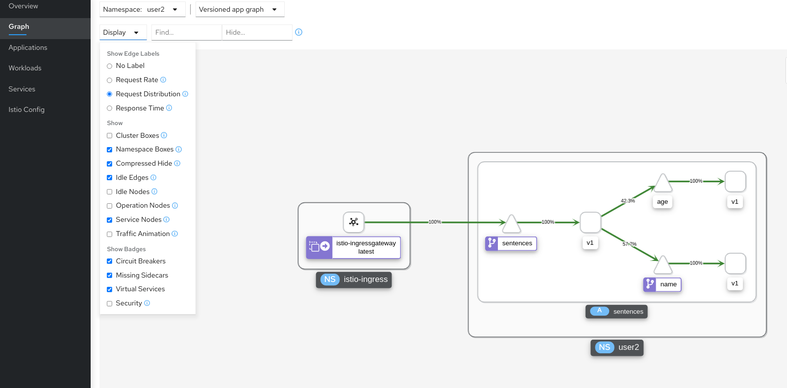

[//]: # (Copyright, Eficode )
[//]: # (Origin: https://github.com/eficode-academy/istio-katas)
[//]: # (Tags: #sentences #kiali)

# Traffic in and out of mesh

## Learning goals

- Understand Istio gateways (ingress)
- Understand how to access external services
- Understand Istio gateways (egress)

## Introduction

These exercises will introduce you to Istio concepts and CRD's for configuring 
traffic **into** the service mesh (Ingress) and out of the service mesh (Egress). 

You will use two Istio CRD's for this. The **Gateway** and the **ServiceEntry** 
CRD's. 

## Exercise 1

The previous exercises used a Kubernetes **NodePort** service to get traffic 
to the sentences service. E.g. the **ingress** traffic to `sentences` **is 
not** flowing through the Istio service mesh. From the `sentences` 
service to the `age` and `name` services traffic **is** flowing through the 
Istio service mesh. We know this to be true because we have applied virtual 
services and destination rules to the `name` service.

Ingressing traffic directly from the Kubernetes cluster network to a frontend
service means that Istio features **cannot** be applied on this part of the 
traffic flow.

In this exercise we are going rectify this by **configuring** ingress traffic 
to the sentences service through a dedicated ingress gateway(`istio-ingressgateway`) 
provided by Istio.

<details>
    <summary> More Info </summary>

A Gateway **describes** a load balancer operating at the **edge** of the mesh 
receiving incoming or outgoing **HTTP/TCP** connections. The specification 
describes the ports to be expose, type of protocol, configuration for the 
load balancer, etc.

An Istio **Ingress** gateway in a Kubernetes cluster consists, at a minimum, of a 
Deployment and a Service. Istio ingress gateways are based on the Envoy and have a 
standalone Envoy proxy. 

Inspecting our course environment would show something like:

```console
NAME                                        TYPE                                   
istio-ingressgateway                        deployment  
istio-ingressgateway                        service
istio-ingressgateway-69c77d896c-5vvjg       pod
```

Inspecting the POD would show something like:

```console
NAME                                    CONTAINERS
istio-ingressgateway-69c77d896c-5vvjg   istio-proxy
```

</details>

### Overview

- Deploy the sentences app

- Create an entry point (Gateway) for the sentences service

- Create a route (Virtual Service) from the entry point to the sentences service

- Run the loop query script with the `-g` option and FQDN

- Observe the traffic flow with Kiali

### Step by Step
<details>
    <summary> More Details </summary>

**Deploy the sentences app**

```console
kubectl apply -f 003-traffic-in-out-mesh/start/
kubectl apply -f 003-traffic-in-out-mesh/start/name-v1/
```

**Create an entry point for the sentences service**

To create an entry point in the `istio-ingressgateway` we use a gateway 
resource. Create a file called `sentences-ingressgateway.yaml` in 
`003-traffic-in-out-mesh/start` directory.

It should look like the below yaml. 

> :bulb: Replace <YOUR_NAMESPACE> in the yaml below with the namespace you 
> have been assigned in this course. Otherwise you might not hit the 
> `sentence` service in your namespace.

```yaml
apiVersion: networking.istio.io/v1beta1
kind: Gateway
metadata:
  name: sentences
spec:
  selector:
    app: istio-ingressgateway
    istio: ingressgateway
  servers:
  - port:
      number: 80
      name: http
      protocol: HTTP
    hosts:
    - "<YOUR_NAMESPACE>.sentences.istio.eficode.academy"
```

The **selectors** above are the labels on the `istio-ingressgateway` POD which is 
running a standalone Envoy proxy.

> You are **not** creating a gateway object with it's own envoy proxy. You are
> creating a definition of an entry point for the istio-ingressgateway deployment.

The servers block is where you define the port configurations and the hosts 
exposed by the gateway. A host entry is specified as a dnsName and should be 
specified using the FQDN format. 

Apply the resource:

```console
kubectl apply -f 003-traffic-in-out-mesh/start/sentences-ingressgateway.yaml
```

**Create a route from the gateway to the sentences service**

In order to actually route traffic from the entry point the sentences 
service you need to define a virtual service. Create a file called 
`sentences-ingressgateway-vs.yaml` in `003-traffic-in-out-mesh/start` 
directory.

```yaml
apiVersion: networking.istio.io/v1beta1
kind: VirtualService
metadata:
  name: sentences
spec:
  hosts:
  - "<YOUR_NAMESPACE>.sentences.istio.eficode.academy"
  gateways:
  - sentences
  http:
  - route:
    - destination:
        host: sentences
```

> Note how it specifies the hostname and the name of the gateway 
> (in `spec.gateways`), i.e. a Gateway definition can define an entry for many
> hostnames and a VirtualService can be bound to multiple gateways, i.e. these 
> are not necessarily related one-to-one.

We also see, that the VirtualService routes all traffic for the given hostname
to the `sentences` service (the two last lines specifying the Kubernetes
`sentences` service as destination).

Apply the resource:

```console
kubectl apply -f 003-traffic-in-out-mesh/start/sentences-ingressgateway-vs.yaml
```

**Run the loop query script with the `hosts` entry**

The sentence service we deployed in the first step has a type of `ClusterIP` 
now. In order to reach it we will need to go through the `istio-ingressgateway`. 
Run the `loop-query.sh` script with the option `-g` and pass it the `hosts` entry.

```console
./scripts/loop-query.sh -g <YOUR_NAMESPACE>.sentences.istio.eficode.academy
```

**Observe the traffic flow with Kiali**



</details>

## Exercise 2

A ServiceEntry allows you to apply Istio traffic management for services 
running outside of your mesh. Like redirecting/forwarding traffic to 
external destinations and defining retries, timeouts and fault injection 
policies.

### Overview

- 

- 

- 

- 
 
- 

- 

### Step by Step
<details>
    <summary> More Details </summary>


</details>

# Summary

XXX

# Cleanup

```console

```
