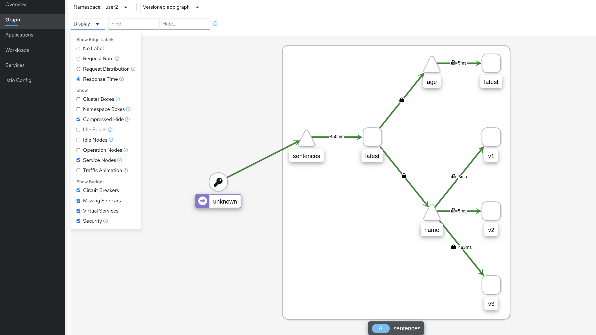

[//]: # (Copyright, Eficode )
[//]: # (Origin: https://github.com/eficode-academy/istio-katas)
[//]: # (Tags: #delay #network-delay #kiali)

# Istio - Distributed Tracing

## Learning goal

- Understand how Istio supports distributed tracing
- Find distributed tracing info in Kiali
- Introduction to Jaeger

## Introduction

This exercise will introduce some network delays and *slightly* more 
complex deployment of the sentences application to **introduce** you to 
another type of telemetry Istio generates. 
[Distributed trace](https://istio.io/latest/docs/concepts/observability/#distributed-traces) 
**spans**. 

It will also introduce you to **one** of the distributed tracing backends 
Istio integrates with. [Jaeger](https://istio.io/latest/docs/ops/integrations/jaeger/).

Istio supports distributed tracing through the envoy proxy sidecar. The proxies 
**automatically** generate trace **spans** on **behalf** applications they proxy. 
The sidecar proxy will send the tracing information directly to the tracing 
backends. So the application developer does **not** know or worry about a 
distributed tracing backend. 

However, Istio **does** rely on the application to propagate some headers for 
subsequent outgoing requests so it can stitch together a complete view of the 
traffic. See more **More Istio Distributed Tracing** below for a list of the 
**required** headers.

<details>
    <summary> More Istio Distributed Tracing </summary>

Some forms of delays can be observed with the **metrics** that Istio tracks. 

> Metrics are statistical and not specific to a certain request, i.e. we can 
> only observe statistical data about observations like sums and averages. 

This is quite useful but fairly limited in a more complex service based 
architecture. If the delay was caused by something more complicated it 
could be difficult to diagnose purely from metrics due to their 
statistical nature. For example the misbehaving application might not be 
the immediate one from which you are observing a delay. In fact, it might 
be deep in the application tree.

Distributed traces with spans provide a view of the life of a request as it 
travels across multiple hosts and service.

> The “span” is the primary building block of a distributed trace, representing 
> an individual unit of work done in a distributed system. Each component of the 
> distributed system contributes a span - a named, timed operation representing 
> a piece of the workflow.
> 
> Spans can (and generally do) contain “References” to other spans, which allows 
> multiple Spans to be assembled into one complete Trace - a visualization of the 
> life of a request as it moves through a distributed system.

In order for Istio to stitch together the spans and provide this view of the life 
of a request. Istio Requires the following 
[B3 trace headers](https://github.com/openzipkin/b3-propagation) to be propagated 
across the services.

- x-request-id
- x-b3-traceid
- x-b3-spanid
- x-b3-parentspanid
- x-b3-sampled
- x-b3-flags
- b3

</details>

## Exercise

You are going to deploy a *slightly* more complex version of the sentences 
application with a (simulated) bug that causes large delays on the combined 
service. 

Then you are going to see how Istio's distributed tracing telemetry is 
leveraged by Kiali and Jaeger to help you identify where the delay is 
happening.

### Overview

- Deploy sentences application

- Run the script `scripts/loop-query.sh`

- Observe the traffic flow with Kiali

- Observe the distributed tracing telemetry in Kiali

- Observe the distributed tracing telemetry in Jaeger

- Add an ingress gateway

- Route traffic through the ingress gateway 

> :bulb: Use the script `scripts/loop-query.sh` with the `-g` option and 
> specify your gateway entry point. E.g. 
`<YOUR_NAMESPACE>.sentences.istio.eficode.academy`.

- Observe the distributed tracing telemetry in Jaeger

### Step by Step
<details>
    <summary> More Details </summary>

- **Deploy sentences application**

```console
kubectl apply -f 008-distributed-tracing/start/
kubectl apply -f 008-distributed-tracing/start/sentences-v2/
```

- **Run the script `scripts/loop-query.sh`**

In another shell, run the following to continuously query the sentence 
service through the **NodePort**.

```console
scripts/loop-query.sh
```

- **Observe the traffic flow with Kiali**

Go to Graph menu item and select the **Versioned app graph** from the drop 
down menu. 

If we open Kiali and select to display 'response time', we see the following,
which shows that `v3` have a significantly higher delay than the two other
versions.



This is a super simple scenario where Istio provided metrics and Kiali can 
give us some insights into the network delay. With a deeper tree and more 
complex debugging scenario we can use distributed tracing to help.

- **Observe the distributed tracing telemetry in Kiali**


- **Observe the distributed tracing telemetry in Jaeger**


- **Add an ingress gateway**

- **Route traffic through the ingress gateway**

- **Observe the distributed tracing telemetry in Jaeger**

</details>

## Summary


## Cleanup

```console
kubectl delete -f 008-distributed-tracing/start/sentences-v2/
kubectl delete -f 008-distributed-tracing/start/
```
