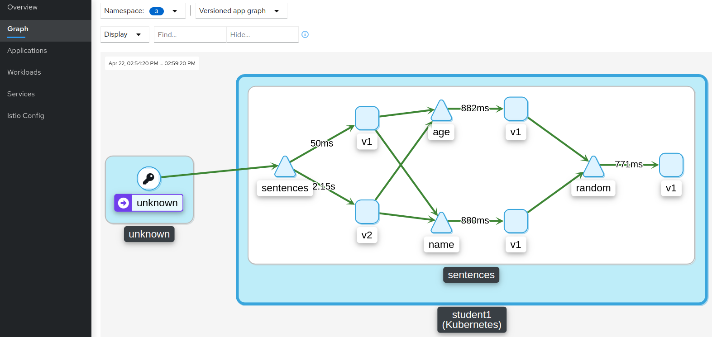
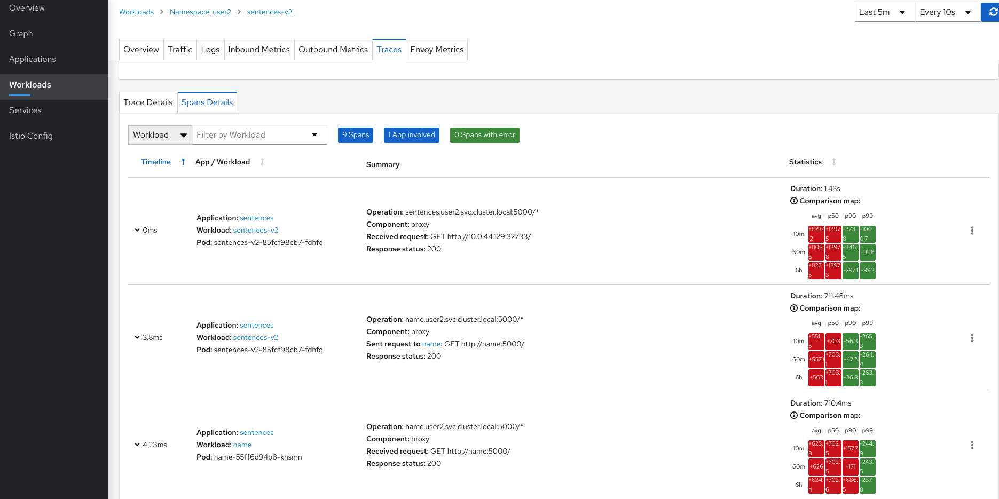
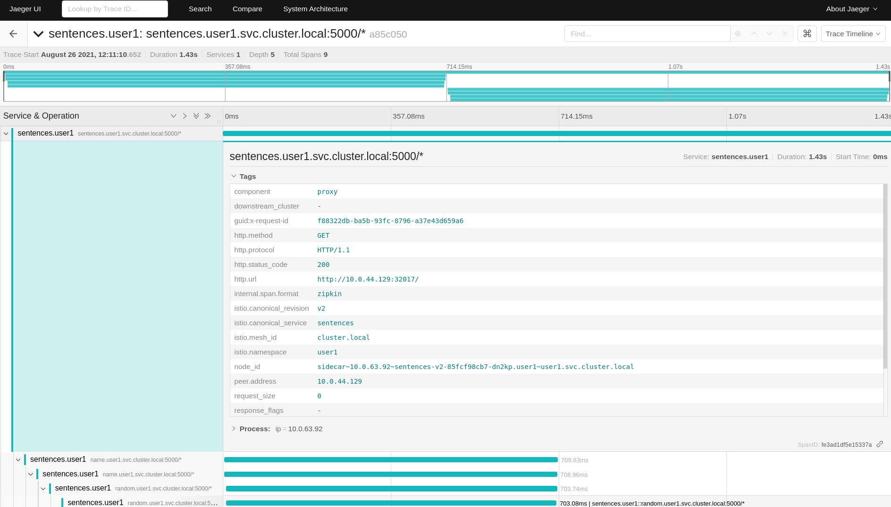

[//]: # (Copyright, Eficode )
[//]: # (Origin: https://github.com/eficode-academy/istio-katas)
[//]: # (Tags: #delay #network-delay #kiali)

# Istio - Distributed Tracing

## Learning goal

- Understand how Istio supports distributed tracing
- Find distributed tracing info in Kiali
- Introduction to Jaeger

## Introduction

This exercise will introduce some network delays and *slightly* more 
complex deployment of the sentences application to **introduce** you to 
another type of telemetry Istio generates. 
[Distributed trace](https://istio.io/latest/docs/concepts/observability/#distributed-traces) 
**spans**. 

It will also introduce you to **one** of the distributed tracing backends 
Istio integrates with. [Jaeger](https://istio.io/latest/docs/ops/integrations/jaeger/).

Istio supports distributed tracing through the envoy proxy sidecar. The proxies 
**automatically** generate trace **spans** on **behalf** applications they proxy. 
The sidecar proxy will send the tracing information directly to the tracing 
backends. So the application developer does **not** know or worry about a 
distributed tracing backend. 

However, Istio **does** rely on the application to propagate some headers for 
subsequent outgoing requests so it can stitch together a complete view of the 
traffic. See more **More Istio Distributed Tracing** below for a list of the 
**required** headers.

<details>
    <summary> More Istio Distributed Tracing </summary>

Some forms of delays can be observed with the **metrics** that Istio tracks. 

> Metrics are statistical and not specific to a certain request, i.e. we can 
> only observe statistical data about observations like sums and averages. 

This is quite useful but fairly limited in a more complex service based 
architecture. If the delay was caused by something more complicated it 
could be difficult to diagnose purely from metrics due to their 
statistical nature. For example the misbehaving application might not be 
the immediate one from which you are observing a delay. In fact, it might 
be deep in the application tree.

Distributed traces with spans provide a view of the life of a request as it 
travels across multiple hosts and service.

> The “span” is the primary building block of a distributed trace, representing 
> an individual unit of work done in a distributed system. Each component of the 
> distributed system contributes a span - a named, timed operation representing 
> a piece of the workflow.
> 
> Spans can (and generally do) contain “References” to other spans, which allows 
> multiple Spans to be assembled into one complete Trace - a visualization of the 
> life of a request as it moves through a distributed system.

In order for Istio to stitch together the spans and provide this view of the life 
of a request. Istio Requires the following 
[B3 trace headers](https://github.com/openzipkin/b3-propagation) to be propagated 
across the services.

- x-request-id
- x-b3-traceid
- x-b3-spanid
- x-b3-parentspanid
- x-b3-sampled
- x-b3-flags
- b3

</details>

## Exercise

You are going to deploy a *slightly* more complex version of the sentences 
application with a (simulated) bug that causes large delays on the combined 
service. 

Then you are going to see how Istio's distributed tracing telemetry is 
leveraged by Kiali and Jaeger to help you identify where the delay is 
happening.

### Overview

- Deploy sentences application

- Run the script `scripts/loop-query.sh`

- Observe the traffic flow with Kiali

- Observe the distributed tracing telemetry in Kiali

- Observe the distributed tracing telemetry in Jaeger

- Add an ingress gateway and virtual service

- Route traffic through the ingress gateway 

> :bulb: Use the script `scripts/loop-query.sh` with the `-g` option and 
> specify your gateway entry point. E.g. 
`<YOUR_NAMESPACE>.sentences.istio.eficode.academy`.

- Observe the distributed tracing telemetry in Jaeger

### Step by Step
<details>
    <summary> More Details </summary>

- **Deploy sentences application**

```console
kubectl apply -f 008-distributed-tracing/start/
kubectl apply -f 008-distributed-tracing/start/sentences-v2/
```

- **Run the script `scripts/loop-query.sh`**

In another shell, run the following to continuously query the sentence 
service through the **NodePort**.

```console
scripts/loop-query.sh
```

- **Observe the traffic flow with Kiali**

Go to Graph menu item and select the **Versioned app graph** from the drop 
down menu. 

If we select to display 'response time' we that there is a significant delay 
introduced by `v2` of the sentences service.



- **Observe the distributed tracing telemetry in Kiali**

This is just a simulated bug and is easy to locate. But in a real world 
scenario the bug may be introduced by interaction of a service deeper in the 
application tree. To do a proper investigation you may need to trace the 
traffic flow of the request through this tree.

Kiali leverages Istio's distributed tracing telemetry and can be used to help 
in this type of scenario.

Browse to **Workloads** on the left hand menu and select the `sentences-v2`
workload. Then select the **Traces** tab.

Here you can see that there are outlier **spans** well over 1 second. These 
are the spans generated by Istio.


Select one of the spans and and Kiali will give you some trace details.


Select the **Span Details** tab and you can see the different spans generated 
by the envoy proxy. Expanding the different entries will let you see details 
about where the request was sent and the response status.



> TODO!: Some explanation about the color schemes and how they are applied.

- **Observe the distributed tracing telemetry in Jaeger**

Jaeger also leverages Istio's distributed tracing and can also be used to 
identify scenarios like this. 

> It can be argued that Jaeger gives an easier to understand and more logical 
> view of the traffic flow of a request.

Browse to Jaeger and select the options as shown below and hit find traces.

> :bulb: Select the sentences service corresponding to **your** namespace. 
> E.g `sentences.user1`, `sentences.user2`, etc.

You should see a trace taking longer than 1 second in the graph and the list 
of traces. 


Select the trace, either from the graph or the list of traces. Then select 
the first entry in the flow and **expand** the **Tags** section.

From the details you can see that the envoy proxy provided the trace. You can 
also see that the version of the sentences service is `v2`. 



- **Add an ingress gateway and virtual service**

The traffic flow in our sentences application is pretty simple with low 
complexity. But in much more complex system with a much more complicated 
traffic flow and many more service the ability of the envoy proxy to provide 
traces without changes required at the application level is quite powerful.

As an example you will create an ingress gateway and virtual service to route 
external traffic through it to the sentences service.

First create a file called `sentences-ingress-gw.yaml` in the directory 
`008-distributed-tracing/start/`.

> :bulb: Edit the hosts field with **your** namespace.

```yaml
apiVersion: networking.istio.io/v1beta1
kind: Gateway
metadata:
  name: sentences
spec:
  selector:
    app: istio-ingressgateway
    istio: ingressgateway
  servers:
  - port:
      number: 80
      name: http
      protocol: HTTP
    hosts:
    - "<YOUR_NAMESPACE>.sentences.istio.eficode.academy"
```

Then create a file `sentences-ingress-vs.yaml` in the directory 
`008-distributed-tracing/start/`.

> :bulb: Again edit the hosts field with **your** namespace.

```yaml
apiVersion: networking.istio.io/v1beta1
kind: VirtualService
metadata:
  name: sentences
spec:
  hosts:
  - "<YOUR_NAMESPACE>.sentences.istio.eficode.academy"
  gateways:
  - sentences
  http:
  - route:
    - destination:
        host: sentences
```

Finally apply the gateway and virtual service.

```console
kubectl apply -f 008-distributed-tracing/start/sentences-ingress-gw.yaml
kubectl apply -f 008-distributed-tracing/start/sentences-ingress-vs.yaml
```

- **Route traffic through the ingress gateway**

Now instead of hitting the NodePort of the sentences service use the 
`./scripts/loop-query.sh` with the `-g` option and the entry point of 
the gateway you just created.

```console
./scripts/loop-query.sh -g <YOUR_NAMESPACE>.sentences.istio.eficode.academy
```

Traffic will now be routed through the ingress gateway and towards the 
sentences service.

- **Observe the distributed tracing telemetry in Jaeger**

Browse to Jaeger and select the options as shown below and hit find traces.

You should be able to see the request flowing through the ingress gateway now.


If you select one of the traces, either from the graph or the list of traces, 
you should be able to see the ingress gateway as part of the traffic flow details.


</details>

## Summary

In this exercise you have seen how Istio's distributed tracing telemetry 
can be leveraged to provide a less intrusive and more cohesive approach 
to distributed tracing.

The main takeaways from this exercise are.

- Istio's envoy proxies generate the distributed trace spans for the services.

- If a service has no proxy sidecar, distributed trace telemetry will not 
be generated.

- Istio's envoy proxies provide the distributed trace telemetry to the 
supported backends integrated with the mesh.

- The only requirement for the service is to propagate the **required** 
B3 trace headers.

## Cleanup

```console
kubectl delete -f 008-distributed-tracing/start/sentences-v2/
kubectl delete -f 008-distributed-tracing/start/
```
