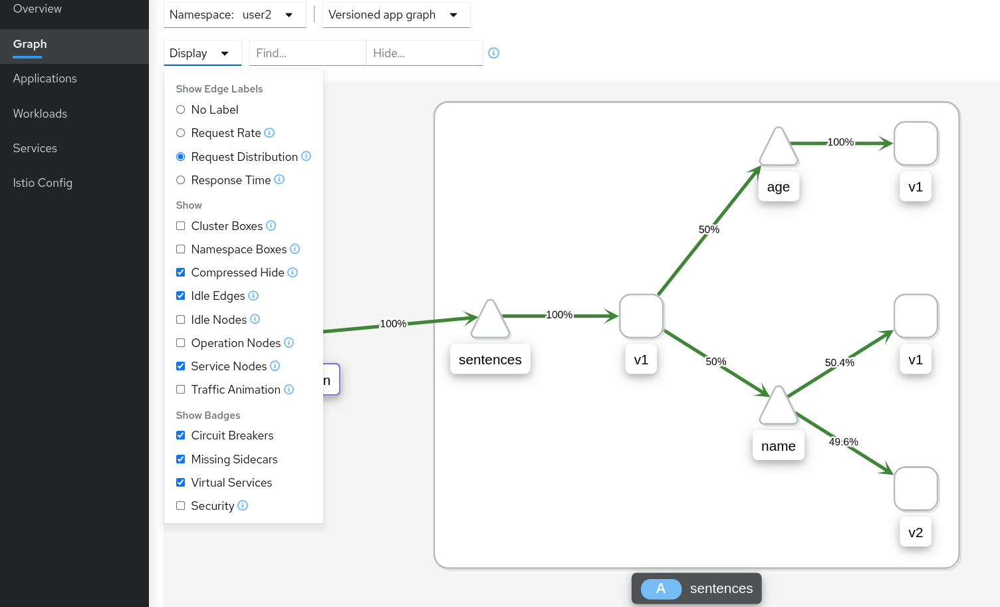
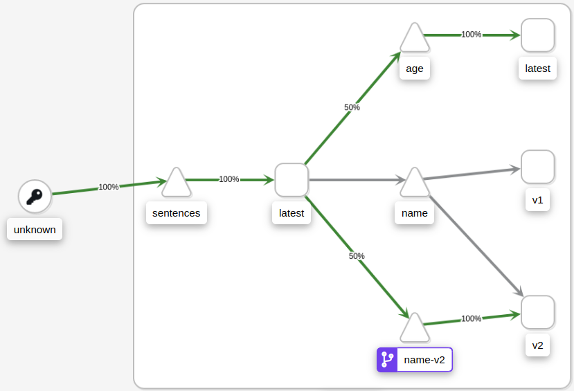

[//]: # (Author: Michael Vittryp Larsen)
[//]: # (Source: https://github.com/MichaelVL/istio-katas)
[//]: # (Tags: #blue-green-deployment #http-header-routing #VirtualService #kiali)

# Blue/green deployments

This exercise will show how to implement blue/green deployments using Kubernetes
services to identify different versions. In exercise [Blue/green deployments
with Kubernetes Labels](blue-green-deployment-w-labels.md) we will extend this
to use Kubernetes labels for identifying different versions.

First, deploy version `v1` of the test application:

```console
kubectl apply -f deploy/v1
```

This created three deployments with associated services. After deployment list
PODs and services with:

```console
kubectl get pod,svc
```

We should see something like the following:

```console
NAME                             READY   STATUS    RESTARTS   AGE
pod/age-79475c5566-5677k         2/2     Running   0          2m18s
pod/name-v1-dfcb76bdf-8lbc4      2/2     Running   0          2m18s
pod/sentences-7d9cc5c899-sms7j   2/2     Running   0          2m17s

NAME                 TYPE        CLUSTER-IP       EXTERNAL-IP   PORT(S)          AGE
service/age          ClusterIP   10.106.5.47      <none>        5000/TCP         2m18s
service/name         ClusterIP   10.97.114.150    <none>        5000/TCP         2m18s
service/name-v1      ClusterIP   10.107.209.9     <none>        5000/TCP         2m18s
service/sentences    NodePort    10.110.120.194   <none>        5000:32005/TCP   2m17s
```

Note that there are two services for `name` - a version specific one `name-v1`
and one non-versioned `name` (referencing all versions of `name`).

In another shell, run the following to continuously query the sentence service
and observe the effect of deployment changes:

```console
scripts/loop-query.sh
```

The `sentences` service will query the `name` Kubernetes service to retrieve a
name. This `name` service does not include a `version` label in its selectors,
i.e. when we deploy version `v2` with the following command, we will see names
returned from both versions of the `name` service

```console
kubectl apply -f deploy/v2
```

If we inspect the traffic flow in Kiali we see the following, which also shows a
50/50 split of traffic towards the two versions of the `name` service. Note that
you may need to select the namespace in which the sentences application is
deployed, the versioned graph and enable showing of requests distribution - the
items marked with red boxes in the image.




> Try inspect the Kubernetes services `name`, `name-v1` and `name-v2` to see how they differ in their label selectors.

## Header Based Routing

What we currently is observing is ordinary Kubernetes load balancing between
PODs behind the `name` service.

Next we will configure our Istio service mesh to route traffic to the two
different version through the Kubernetes services `name-v1` and `name-v2`. Since
our aim is blue/green deployment, we want to be able to deliberately choose
which version of `name` we use, however, since we only access the `name` service
indirectly through the `sentences` service we need some way of communicating
this information. We do this through [HTTP
headers](https://en.wikipedia.org/wiki/List_of_HTTP_header_fields).

In particular we will use the header `x-test` to indicate our version
preference. Use the following command to continuously run a query against the
sentence service with the `x-test` HTTP header set to the value of `use-v2`:


```console
scripts/loop-query.sh 'x-test: use-v2'
```

Since we haven't yet changed the routing, both query commands return results
from both `name-v1` and `name-v2`.

To configure routing in the Istio service mesh based on the `x-test` header we will use the following Istio [VirtualService](https://istio.io/latest/docs/reference/config/networking/virtual-service):

```yaml
apiVersion: networking.istio.io/v1alpha3
kind: VirtualService
metadata:
  name: name
spec:
  hosts:
  - name
  gateways:
  - mesh
  http:
  - match:
    - headers:
        x-test:
          exact: use-v2
    route:
    - destination:
        host: name-v2
  - route:
    - destination:
        host: name-v1

```

Create the VirtualService resource:

```console
kubectl apply -f deploy/virtual-service-svc-based.yaml
```

Now we only see responses from `v2`. In Kiali we see a VirtualService is
configured for the `name` service and that all requests are flowing towards
`v2`:



Inspect the file `deploy/virtual-service-svc-based.yaml` to see how routing
towards the host `name` is directed to either the service `name-v1` or `name-v2`
based on the content of the header `x-test`. More info about Istio [Virtual
Service can be found
here](https://istio.io/latest/docs/reference/config/networking/virtual-service).

This exercise showed how a Istio
[VirtualService](https://istio.io/latest/docs/reference/config/networking/virtual-service/)
could be used to modify routing from a host `name` to alternative hosts
`name-v1` and `name-v2` with the hosts being represented by Kubernetes
services. Istio routing however, not limited to Kubernetes services and this
approach could be used for other service types, including services external to
Kubernetes.

# Cleanup

```console
kubectl delete -f deploy/v1
kubectl delete -f deploy/v2
kubectl delete -f deploy/virtual-service-svc-based.yaml
```
