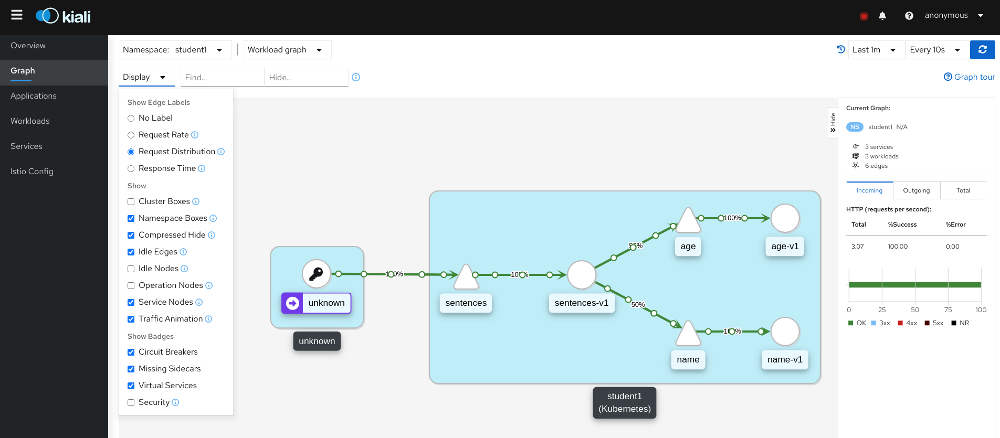

[//]: # (Copyright, Eficode )
[//]: # (Origin: https://github.com/eficode-academy/istio-katas)
[//]: # (Tags: #sentences #kiali)

# Introducing the setup

## Learning goal

- Try out the sentences application
- Add the applications traffic to the istio service mesh
- Familiarize yourself with the Kiali management console

## Introduction

This exercise introduces the sentences application which you will be using during the course.
It also introduces you to the Kiali management console for the Istio service mesh.

<details>
    <summary> More Info </summary>

### Sentences application

This application implements a simple 'sentences' builder, which can build
sentences from the following simple algorithm:

```
age = random(0,100)
name = random(['Peter','Ray','Egon'])
return name + ' is ' + age + ' years'
```
The application is made up of three services, one which can be queried for the
random age, one which can be queried for a random name and a frontend sentence service, which
calls the two other through HTTP requests and formats the final sentences.

### Kiali

Kiali provides dashboards and observability by showing you the structure and 
health of your service mesh. It provides detailed metrics, Grafana access and 
integrates with Jaeger for distributed tracing.

One of it's most powerful features are it's graphs. They provide a powerful way 
to visualize the topology oy your service mesh. 

It provides four main graph renderings of the mesh telemetry.

* The **workload** graph provides the a detailed view of communication between workloads.

* The **app** graph aggregates the workloads with the same app labeling, which provides a more logical view.

* The **versioned app** graph aggregates by app, but breaks out the different versions providing traffic breakdowns that are version-specific.

* The **service** graph provides a high-level view, which aggregates all traffic for defined services.

</details>

## Exercise 1

- Deploy the sentences application with kubectl. It is located under the `deploy/setup-introduction` directory.

- Observe the number of pods running.

- Run the script `scripts/loop-query.sh` to produce traffic and observe the output.

- Open Kiali find the sentences application view and browse info, traffic and metrics.

> :bulb: Filter on your user namespace, e.g. user1, user2, etc.

### Step by Step
<details>
    <summary> More Details </summary>

**Deploy version 1 of the sentences application**

Open a terminal in the root of the git repository (istio-katas) and use `kubectl` to deploy `v1` of the application.

```console
kubectl apply -f deploy/setup-introduction
```

**Observe the number of services and pods running**

```console
kubectl get pod,svc
```

You should see something like:

```console
NAME                             READY   STATUS    RESTARTS   AGE
pod/age-7976688957-mbvzz         1/1     Running   0          2s
pod/name-v1-587b56cdf4-rwcwt     1/1     Running   0          2s
pod/sentences-6dffccb8c6-7fd57   1/1     Running   0          2s

NAME                TYPE        CLUSTER-IP       EXTERNAL-IP   PORT(S)          AGE
service/age         ClusterIP   172.20.123.133   <none>        5000/TCP         2s
service/name        ClusterIP   172.20.108.51    <none>        5000/TCP         2s
service/sentences   NodePort    172.20.168.218   <none>        5000:30326/TCP   2s
```

**Run the `loop-query.sh` script** 

In another shell, run the following to continuously query the sentence service and observe the output:

```console
./scripts/loop-query.sh
```

Traffic is now flowing between the services.

**Browse to kiali and investigate the traffic flow**


> :bulb:
> The red icons beside the workloads mean we have no istio sidecars deployed.
> Browse the different tabs to see that there is no traffic nor metrics being captured. 
> As there are no sidecars the traffic is not part of the istio service mesh.
> If there we sidecars you would see two containers per pod when you run `kubectl get pods`.

</details>

## Exercise 2

- Pull the sentences application down.

- Enable automtatic sidecar injection for **your** namespace, e.g. user1, user2, etc, with label `istio-injection=enabled`.

- Redeploy sentences application.

- Observe that an envoy sidecar proxy is deployed in the pod.
 
- Run the `loop-query.sh` script to produce traffic.

- Open Kiali find the sentences application view and browse info, traffic and metrics.

- Investigate the different graphs provided by kiali.

### Step by Step
<details>
    <summary> More Details </summary>

**Pull sentences application down**

```console
kubectl delete -f deploy/setup-introduction
```

**Enable automtatic sidecar injection**

```console
kubectl label namespace <USERNAME HERE> istio-injection=enabled
```

**Redeploy sentences application**

```console
kubectl apply -f deploy/setup-introduction
```

**Observe envoy proxy**

```console
kubectl get pods -o=custom-columns=NAME:.metadata.name,CONTAINERS:.spec.containers[*].name
```

This should show two containers for each service and should look like this.

```console
NAME                            CONTAINERS
age-v1-676bf56bdd-m6bcj         age,istio-proxy
name-v1-587b56cdf4-6tnhs        name,istio-proxy
sentences-v1-6ccc9fdcc5-fzt2g   sentences,istio-proxy
```

**Run the loop-query.sh script**

```console
./scripts/loop-query.sh
```

**Browse kiali and investigate the traffic flow**


Now you can see there are sidecars and the traffic is part of the mesh. 

Browse the different tabs to see the traffic and metrics being captured.

> :bulb: It may take a minute before Kiali starts showing the traffic.
> You can change the refresh rate in the top right hand corner.

**Investigate the different graphs**

Browse to the graphs and investigate the **service**, **workload**, **app** 
and **versioned app** graphs. 

> :bulb: Use the display options to modify what is shown in the 
> different graphs. Showing request distribution is something
> we will be using often.




</details>

## Summary

Excercise 1 introduced you to the sentences application and Kiali. There is not 
enough time in the course to go into much more details around Kiali. But it has 
more features like the Istio Wizards feature which lets you create delete 
istio configuration on the fly. It can do validation on the most common Istio 
objects and more. See the [documentation](https://kiali.io/documentation/latest/features/) 
for a more complete overview.

Excercise 2 uses automatic sidecar injection and this is what we will be using 
for the rest of the course. Most of the time this is what you want to do instead 
manually injecting sidecars.

It ensures a more **pervasive** and homogenous observaibility. It is less intrusive as 
it happens at the pod level and you won't see any changes to the deployment itself.

You can find more information about the two different methods [here](https://istio.io/latest/docs/setup/additional-setup/sidecar-injection/).

And you can find more details about sidecar configuration [here](https://istio.io/latest/docs/concepts/traffic-management/#sidecars).

# Cleanup

```console
kubectl delete -f deploy/setup-introduction
```
