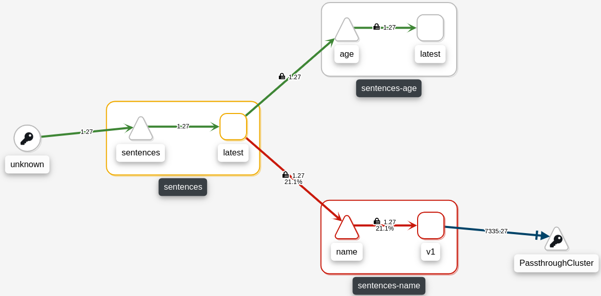

# When not to use TLS

While it could be a natural reaction to apply TLS where possible to protect
traffic, there are actually situations where we might not want to apply TLS - or
at least consider the trade-off between observability and strongest end-to-end
encryption.

To illustrate this, first deploy the sentences application:

```sh
kubectl apply -f deploy/no-tls/sentences.yaml
```

and run the following script to query for sentences.

```sh
scripts/loop-query.sh
```

The application is deliberately designed to exhibit intermittent errors,
i.e. the `name` service use an external service for producing random numbers and
this has been designed to cause an HTTP 404 error in about 10% of the requests.

However, if we observe the application in Kiali, we see that the `name` service
is failing but we cannot see that it is really caused by an downstream failure
in the `random` service.



The reason why we cannot observe the failures in Kiali is that the application
is using HTTPS out from the `name` service towards the `random` service,
i.e. application end-to-end TLS. The `name` service is configured with the
following environment variable for the `random` service - note the `https://`:

```
    spec:
      containers:
      - image: michaelvl/sentences:v1
        env:
        - name: "SENTENCE_RANDOM_SVC_URL"
          value: "https://httpbin.org/bytes/1"
    ...
```

Since the HTTPS traffic is encrypted, the Istio proxy cannot inspect the traffic
and observe the failures. In Kiali we also see the downstream traffic from the
`name` service as being a `TCP connection` and not `HTTP`, which is also a sign
that the Istio proxy cannot inspect the traffic.

Lets switch the downstream `random` service URLs to HTTP instead of HTTPS:

```sh
kubectl apply -f deploy/no-tls/sentences-http.yaml
```

With this we see, that the traffic type changes to HTTP and we also see that the
failures are attributed to the upstream `random` service. In the statistics in
right side we also see that the error cause is 404 errors.


The traffic is now un-encrypted. To configure the Istio proxy to originate
HTTPS/TLS traffic towards the `random` service (which is the external,
internet-based `httpbin.org`), we configure the following two resources:

```
apiVersion: networking.istio.io/v1beta1
kind: DestinationRule
metadata:
  name: random-int
spec:
  host: httpbin.org
  trafficPolicy:
    portLevelSettings:
    - port:
        number: 80
      tls:
        mode: SIMPLE
---
apiVersion: networking.istio.io/v1beta1
kind: ServiceEntry
metadata:
  name: random-int
spec:
  hosts:
  - httpbin.org
  ports:
  - number: 80
    name: http-port
    protocol: HTTP
    targetPort: 443
  - number: 443
    name: https-port
    protocol: HTTPS
  resolution: DNS
  location: MESH_EXTERNAL
```

The DestinationRule specify, that for traffic towards `httpbin.org` on port 80,
traffic should be TLS encrypted. The ServiceEntry specify, that traffic for
`httpbin.org` on port 80 should be changed to port 443.

Apply the two resources:

```sh
kubectl apply -f deploy/no-tls/service-entry-dest-rule.yaml
```

In Kiali we see that traffic is now directed towards a ServiceEntry, but
unfortunately Kiali does not show that traffic is now encrypted.


# Cleanup

```sh
kubectl delete -f deploy/no-tls/service-entry-dest-rule.yaml
kubectl delete -f deploy/no-tls/sentences.yaml

```
